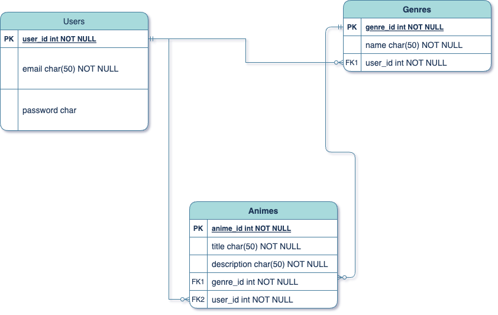

# Favorite Anime API
#### Description:
This is my first attempt developing a local API with Spring Boot. It handles CRUD endpoints to write, store, and access 
data from a relational database. Developers will be able to modify Genres and Anime data with the available endpoints.

Postman Page


## Technologies Used
- ### Version Control:
    - 
- ### Developer Tools:
    - 
    - 
- ### Programming Skills:
    - 
    - 
    - 
    - 

## Approach
My focus was functionality first, so developers can utilize the API with minimum bugs and ambiguity. In addition, the application 
requires user registration and logging in for authorization and authentication. Every Anime endpoint are designed to be accessed through 
Genre endpoints.



## User Stories
- As a developer, I should be able to use CRUD endpoints for the Genres table.
- As a developer, I should be able to use CRUD endpoints for the Anime table.
- As a new developer, I should be able to register with a unique email address and password.
- As a developer, I should be able to log in with my credentials.

## [Initial Plan](https://github.com/users/t-hendricks/projects/5)
[Issues](https://github.com/t-hendricks/springboot-anime-api/issues?q=is%3Aissue+is%3Aclosed)

## Bugs
- Duplicate Anime records with different Genres.

## Future Plans
- Refactor POST endpoint for Anime model to eleminate duplicate records.

## Installation
To set up the app locally on your own system:
1. Fork this [repository](https://github.com/t-hendricks/springboot-anime-api)
2. Copy the link [here](https://github.com/t-hendricks/springboot-anime-api.git) or from the green Code combo button, then in your terminal using either git bash or linux, clone this repo with copied link:
```
git clone <https://github.com/user/repo>
```
3. Then open the repo in IntelliJ or your IDE of choice
4. All required dependencies are included